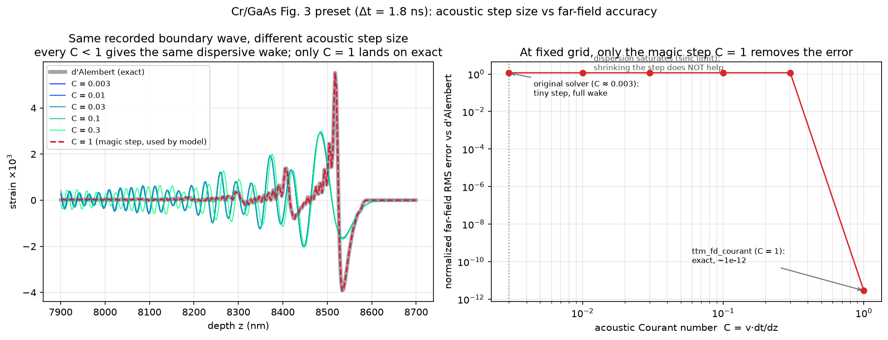
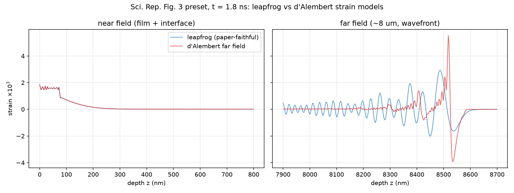
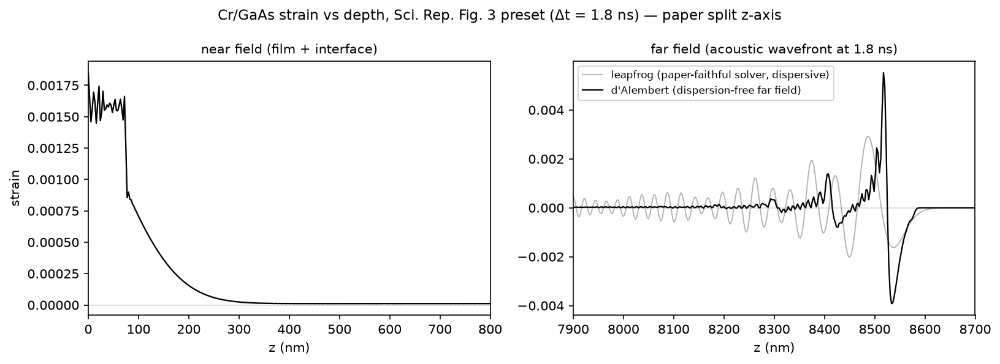
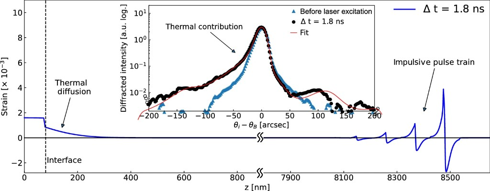

# Acoustic models

This repo supports switchable strain models (see `strain_wave.models.base`).
Three are currently registered; all use the *same* two-temperature (TTM)
thermal solve and differ only in how the elastic wave reaches the far field.

| model | far field | use when |
|---|---|---|
| `ttm_dalembert_cr_gaas` (**default**) | exact d'Alembert translation beyond a monitor plane | physically meaningful far-field strain (e.g. Sci. Rep. Fig. 3 pulse train); all new work |
| `ttm_fd_courant_cr_gaas` | boundary-driven GaAs FD field at C=1 beyond the same monitor plane | validated numerical foundation for future physics that breaks d'Alembert assumptions |
| `ttm_cr_gaas` | leapfrog FD everywhere | **historical reference**: reproducing the notebook / thermo-elastic-gaas (tag `paper-v1.0`) bit-for-bit |

Select with `--model` on the CLI, or `SimulationConfig(model=...)`. The
d'Alembert model is the default because, for the region beyond the interface
(homogeneous, undamped, right-going wave), the d'Alembert translation is the
*exact* solution of the continuum equations — any difference from the leapfrog
far field is quantified numerical error, and the published Fig. 3 pulse train
matches the d'Alembert morphology.

```bash
python scripts/run.py --preset paper_fig3_gaas --no-show           # default (d'Alembert)
python scripts/run.py --preset paper_fig3_gaas --model ttm_fd_courant_cr_gaas --no-show
python scripts/run.py --preset paper_fig3_gaas --model ttm_cr_gaas --no-show  # historical
```

## Why a second model exists: numerical dispersion at tiny Courant number

The original solver uses a single time step for both heat diffusion and the
elastic wave, set by thermal stability:

- `dt = dz^2 / 2 / 0.002 ≈ 1.78 fs` (for `dz = 2.67 nm`)
- acoustic Courant number `C = v_GaAs * dt / dz ≈ 0.003`

The second-order leapfrog scheme has numerical phase velocity

    v_num / v = sin(k dz / 2) / (k dz / 2)   (limit C -> 0)

so short-wavelength components travel *slower* than `v`. The error is tiny
per cell but accumulates with propagation distance. For the Fig. 3 preset the
strain pulse travels ~8.5 um (~3200 cells); components with ~50 nm wavelength
lag the front by hundreds of nm, producing a chirped oscillatory wake behind
the wavefront. That wake is a numerical artifact: the published Fig. 3
(Jo et al., Sci. Rep. 12, 16606 (2022)) instead shows a discrete pulse train
with ~114 nm spacing (film round-trip time 2*80 nm / v_Cr times v_GaAs) and
amplitudes decaying by the interface reflection coefficient
`r = (Z_Cr - Z_GaAs)/(Z_Cr + Z_GaAs) ≈ 0.23` per round trip.

## How `ttm_dalembert_cr_gaas` works

Dispersion accumulates with distance, but everything near the interface —
pulse generation in the 80 nm film, film round trips, transmission into the
substrate — happens over tens of cells and is computed accurately by the
trusted FD solver. The substrate beyond the interface is homogeneous with an
absorbing far boundary, so the acoustic field there is purely right-going and
obeys d'Alembert's solution exactly: `eta(z, t) = f(t - z/v)`.

The model therefore:

1. runs the unmodified TTM + leapfrog solver, recording strain and substrate
   temperature time-histories at a monitor plane 10 cells (~27 nm) inside the
   substrate;
2. subtracts the quasi-static thermal strain `3*beta_GaAs*(T_s - T0)` from the
   record to isolate the right-going acoustic wave;
3. maps the acoustic record to depth exactly:
   `eta_ac(z, t_max) = eta_ac(z_monitor, t_max - (z - z_monitor)/v_GaAs)`;
4. adds back the local thermal strain and rebuilds displacement by
   integrating strain.

Film, interface, and near-field strain are bit-identical to `ttm_cr_gaas`
(enforced by `tests/test_smoke.py`); only `z > z_monitor` is replaced.

Remaining approximations: the sharpest edges of high-order film echoes still
carry some dispersion from their round trips inside the film itself
(n-th echo travels 2*n*80 nm of FD grid before transmission), but echo
amplitudes decay like `0.23^n`, so only the first few matter.

## Courant-matched FD foundation

`ttm_fd_courant_cr_gaas` was added in anticipation of physics for which
d'Alembert translation is no longer valid: distributed carrier generation,
transport, recombination and deformation-potential stress; buried interfaces
and reflections; spatially varying elastic properties; damping; or nonlinear
constitutive laws.

It is intentionally a **new model**, not a modification of the historical
`ttm_cr_gaas`. The current implementation uses the same near-field/interface
calculation and acoustic monitor record as the d'Alembert model, then advances
a boundary-driven finite-difference strain field through homogeneous GaAs.
Its separate acoustic clock uses

    dt_acoustic = dz / v_GaAs
    C = v_GaAs * dt_acoustic / dz = 1

At C=1, the second-order leapfrog dispersion relation is exact on the grid.
The acoustic clock starts by less than one step before t=0, allowing it to
land exactly on `t_max` without reducing C. The far boundary uses the
corresponding exact outgoing update.

This is a **validated foundation, not yet a carrier or multilayer model**.
Adding those effects requires extending the FD field with distributed source
terms and/or variable material coefficients. The important starting point is
that the propagator has no baseline numerical-dispersion error in the
source-free homogeneous limit.

### Required acceptance limit

Two tests prevent regression:

1. `tests/test_courant_fd.py::test_courant_one_fd_equals_dalembert_translation`
   sends a synthetic bipolar boundary pulse through the FD grid and compares
   every point to analytic retarded-time translation.
2. `tests/test_courant_fd.py::test_cr_gaas_fd_matches_dalembert_in_source_free_substrate`
   compares the integrated Cr/GaAs models.

The full paper-preset check is:

```bash
python scripts/validate_fd_courant.py
```

For the 2026-07-18 1.8 ns run:

- acoustic Courant number: exactly 1;
- acoustic steps: 3,186 (versus 1,009,973 thermal steps);
- maximum absolute FD–d'Alembert strain difference: `2.29e-14`;
- normalized RMS difference: `5.11e-12`;
- correlation: `0.9999999999999993`;
- peak-position difference: `0.0 nm`;
- acceptance: **PASSED**.

The machine-readable record is `docs/fd_courant_acceptance.json`.

### Why C = 1 specifically (the step-size sweep)

`scripts/demo_courant_convergence.py` takes the *same* recorded Cr/GaAs
acoustic boundary history and propagates it through the same leapfrog scheme at
a sweep of acoustic Courant numbers, comparing each to d'Alembert:



The result is not a gentle convergence — it is nearly all-or-nothing:

- For every `C < 1` the far field shows essentially the same dispersive wake
  (normalized RMS error ≈ 1.16). Numerical dispersion of the pulse's sharp
  (short-wavelength) content **saturates** at the `C → 0` "sinc limit"
  `v_num/v ≈ sinc(k·dz/2)`, which is independent of `C`. So the original
  solver's tiny step is not the problem, and *shrinking* the step does not
  help.
- At exactly `C = 1` the leapfrog dispersion relation is exact for all
  wavelengths on the grid, and the error collapses to ~1e-12 (roundoff /
  interpolation only).

This is the concrete justification for the magic-step design: at a fixed grid
you must either hit `C = 1` or refine `dz` drastically (cost ∝ dz⁻², since the
thermal step scales as dz²). `ttm_fd_courant_cr_gaas` takes the former route.

## Validation matrix result (paper_fig3_gaas preset)

`scripts/validation_matrix.py` runs both models and pushes both strain
profiles through xrd-strain-simulation with both instrument models.
Figures: `docs/images/matrix_strain_far.png` (here) and
`docs/images/matrix_rocking.png` (in xrd-strain-simulation, which also has a
guide to reading it — panels are instruments, colors are strain models).



For a direct overlay against the published Fig. 3 strain panel — corrected
d'Alembert strain on the paper's exact split z-axis (0–800 nm and
7900–8700 nm) — see `docs/images/fig3_strain_split_dalembert.png`, generated by
`scripts/plot_fig3_strain_split.py`:



Benchmark target — the published Fig. 3 (Jo et al., Sci. Rep. **12**, 16606
(2022), CC BY 4.0). Note the "thermal diffusion" near field and the "impulsive
pulse train" near 8.5 μm that the d'Alembert model recovers:



Key numbers from the 2026-07-18 run (`results/matrix/matrix_summary.json`):

- near field (0–800 nm): identical by construction.
- far field (7.9–8.5 um): leapfrog shows a dispersive wake with ~55 nm
  dominant wavelength; d'Alembert shows a sharp bipolar wavefront plus echoes
  spaced ~100–114 nm — the discrete pulse train seen in the published Fig. 3.
- peak strain at the wavefront nearly doubles (2.9e-3 -> 5.5e-3) once
  dispersion no longer smears the pulse.
- rocking curves: max |Δ log10 I| between the two strain models is ~0.6–0.8
  and confined to the weak shoulder ~+50 to +150 arcsec; the Bragg peak and
  near-peak structure are unchanged. This confirms the earlier diagnosis that
  the dispersion artifact barely affects the diffraction observable.

Instrument axis (the two rocking-curve panels): the `empirical` effective
resolution (dominant σ ≈ 22 arcsec) smooths far more than the `aps_7idc`
model at the paper's stated 1.8 arcsec, and matches the smoothness of the
published Fig. 3 curve better. See the xrd repo's `docs/INSTRUMENTS.md`.
