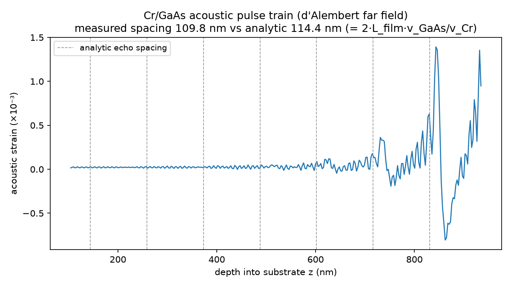

# Strain-model validation

This repo carries two complementary, automated validation layers that should be
green **before** any comparison to experimental data (APS 7ID, Pohang Light
Source) or extension to new substrates and physics. They are the "acceptance
suite" referenced in the maintenance notes and in `docs/ACOUSTIC_MODELS.md`.

| Layer | What it guarantees | Entry point |
|-------|--------------------|-------------|
| **Numerical equivalence** | The Courant-one FD substrate field (`ttm_fd_courant_cr_gaas`) reproduces the analytic d'Alembert far field to interpolation/roundoff for the full 1.8 ns paper preset. | `scripts/validate_fd_courant.py` → `docs/fd_courant_acceptance.json` |
| **Physics acceptance** | The models reproduce known *physical* behaviour (acoustic echo structure, film thermalization) and confirm the numerical-dispersion diagnosis. | `scripts/validate_physics.py` → `docs/physics_acceptance.json` |

Both are also enforced as `pytest` regressions:
`tests/test_courant_fd.py` and `tests/test_physics_acceptance.py`.

## Physics acceptance checks

Run:

```bash
python scripts/validate_physics.py            # writes report + figure, exits nonzero on failure
python -m pytest tests/test_physics_acceptance.py -q
```

The suite is intentionally built on *model-independent, analytic* reference
values (not frozen numerical snapshots), so it catches real regressions and
documents the physics.

### 1. Acoustic pulse-train diagnostics

The film acts as an acoustic Fabry–Pérot cavity: each round trip launches a
strain echo into the substrate.

- **Echo spacing.** Successive echoes are separated in the substrate by
  `Δz = 2·L_film·(v_GaAs / v_Cr)`. For the 80 nm Cr / GaAs paper case this is
  ≈ 114 nm; the suite measures ≈ 110 nm from the d'Alembert far field via
  autocorrelation (< 5% off). Tolerance: 12%.
- **Echo decay = impedance reflectivity.** The first trailing echo / leading
  pulse amplitude ratio should approach the Cr→GaAs pressure reflection
  magnitude `|r| = |(Z_Cr − Z_GaAs)/(Z_Cr + Z_GaAs)| ≈ 0.23` (Z = ρ·v). The
  suite measures ≈ 0.26. Tolerance: factor of 2 about `|r|`.
- **Thickness scaling.** Echo spacing scales linearly with film thickness:
  `Δz(120 nm)/Δz(80 nm) ≈ 1.5` (measured 1.54). Tolerance: 12%.



### 2. Lumped two-temperature thermalization

A 0-D electron/phonon integration using the same laser source, `γ_Cr` and `C_p`
as the full solver (diffusion neglected) isolates the film heat channel:

- electron–phonon equilibration is **picosecond-scale** (1/e time ≈ 0.5 ps for
  the paper G), consistent with the paper's few-ps thermalization estimate;
- the time constant **scales as ~C_e/G**, i.e. inversely with the coupling:
  τ(G/2) ≈ 1.0 ps > τ(G) ≈ 0.5 ps > τ(2G) ≈ 0.25 ps.

### 3. Numerical-dispersion convergence

The relative far-field RMS difference between the raw leapfrog field and the
dispersion-free d'Alembert field **grows monotonically with propagation
distance** (≈ 0.79 → 1.19 → 1.85 as the wavefront advances 378 → 756 →
1512 nm). This is the quantitative confirmation that the leapfrog far-field
wake is propagation-accumulated numerical dispersion (from the tiny acoustic
Courant number of the thermally-limited time step), not physics. See
`docs/ACOUSTIC_MODELS.md` and `docs/images/courant_convergence.png`.

## When to re-run

- After any change to `models/ttm_cr_gaas_solver.py`, the d'Alembert / FD
  models, or the paper preset.
- Before adding a new substrate or new physics (carrier stress, damping): the
  suite defines the source-free Cr/GaAs baseline the new physics must reduce to.
- The checked-in `docs/physics_acceptance.json` is the run-of-record; diff it
  after re-running to see what moved.
